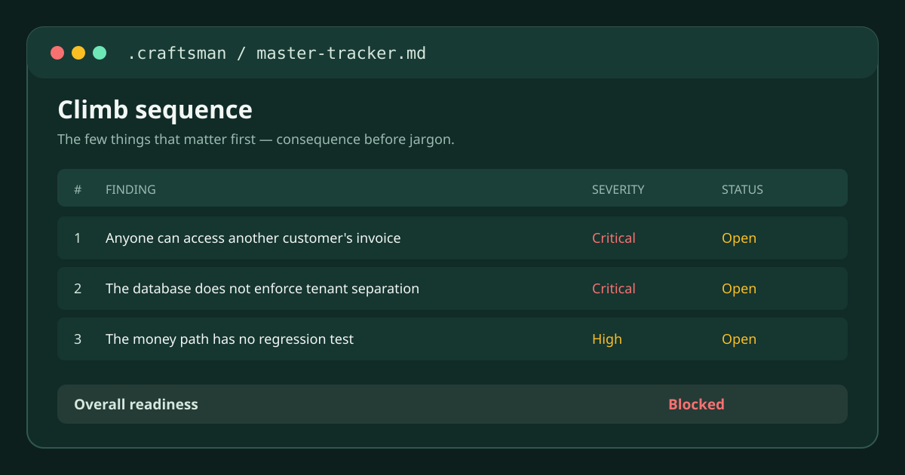

# craftsman


**The engineering review you'd get from the technical co-founder you don't have.**

You built a real app without being an engineer. It works. You're about to let real users in, maybe
take payments, maybe hold their data. Most people in that position could not say what a senior
engineer would flag. That gap doesn't show up until something breaks in front of a customer.

`craft-audit` is that review. Point it at your project and it audits the whole thing for
production-readiness, not just one file or one pull request: it works out what your project
actually is, then finds the gaps between a working demo and something you'd trust with real
customers. It writes everything it finds to disk so you can pick it back up later instead of
losing the work.

Written by [Atif Gul](https://github.com/atifgul99). Every opinion in it comes from 25 years of
building and shipping enterprise software, including time at Microsoft and Amazon, and from
watching what breaks when these standards get skipped.

## In short

It's free and MIT licensed. It runs inside your own Claude Code or Codex session and collects no
telemetry (see [SECURITY.md](./SECURITY.md)). The plugin does not send your project files or audit
findings to Craftsman. Its review guidance is bundled locally; `craft-audit` only reads your code.
The writes it makes are a new local folder, `.craftsman/`, holding its notes, and a line in your
project's `.gitignore` (the file that tells git which files to skip) so that folder stays out
of version control. If your project doesn't have a `.gitignore` yet, it creates one with that line;
if it does, it just appends the line. Nothing in your app's own code changes unless you separately ask `craft-fix`,
and it asks for your sign-off before it touches anything. Expect under an hour for a typical
single-app audit. It applies the same standard every time, to every project you point it at,
instead of a slightly different one each run.

## Is this for you

You shipped something real with Claude Code, Codex, Lovable, Replit, Bolt, or v0. It works, and it demos
well. You don't have an engineering background, and you can't say for sure what a senior engineer
would flag before you let paying customers in. If that's you, this is for you. If you already have
someone doing this kind of review, you probably don't need it.

## Install

**Install the plugin named `craftsman`—not the skill named `craft-audit`.** There are four names
that look similar but have different jobs:

| This is a… | Exact name | Use it for… |
| --- | --- | --- |
| Repository / marketplace source | `gul-labs/craftsman-marketplace` | Adding the marketplace |
| Marketplace | `craftsman-marketplace` | Selecting the marketplace |
| Plugin | `craftsman` | Installing the plugin |
| Main entry skill | `craft-audit` | Starting an audit after installation |

Adding a marketplace does **not** install the plugin. Run both commands in the order shown below.

### Claude Code

You need Claude Code installed first: see [code.claude.com/docs](https://code.claude.com/docs).

Type these into Claude Code's chat box, not a terminal:

```
/plugin marketplace add gul-labs/craftsman-marketplace
/plugin install craftsman@craftsman-marketplace
```

Then start a new Claude Code conversation. If Claude Code tells you to reload plugins, run
`/reload-plugins` first. Open `/plugin` to confirm **Craftsman** appears under Installed.

If you're working headlessly (running Claude Code without the interactive chat window, e.g. from a
script), use the terminal equivalents instead:

```bash
claude plugin marketplace add gul-labs/craftsman-marketplace
claude plugin install craftsman@craftsman-marketplace
claude plugin list --json
```

### Codex

Install from the same marketplace in Codex:

```bash
codex plugin marketplace add gul-labs/craftsman-marketplace
codex plugin add craftsman@craftsman-marketplace
codex plugin list --marketplace craftsman-marketplace --json
```

Start a new Codex chat after installation. Open `/plugins` to inspect installed plugins. The JSON
listing should show the `craftsman` plugin from the `craftsman-marketplace` marketplace.

For a local clone, pass its absolute path to `codex plugin marketplace add` instead. Codex and
Claude Code load the same 12 skill folders.

### First use

In the project you want to assess, say:

> Use `craft-audit` to tell me whether this app is production-ready. Do not modify anything yet.

`craft-audit` is a skill inside the installed plugin. It is never an install target, so do not run
`craft-audit@craftsman-marketplace`.

### Installing from an LLM or coding agent

When you give an LLM only this repository URL, give it this instruction too:

```text
Install Craftsman from https://github.com/gul-labs/craftsman-marketplace.

First identify the host: Claude Code or Codex. Read this README and INSTALL.md before acting.
The source is gul-labs/craftsman-marketplace; the marketplace is craftsman-marketplace; the plugin
to install is craftsman; craft-audit is the first skill to invoke after installation, not a plugin.
Use the host-native marketplace commands, verify that craftsman is installed and enabled, then start
a new chat/session. Do not run an audit or modify the project until I ask.
```

For updates, stale-install recovery, uninstallation, and host-specific troubleshooting, see
[INSTALL.md](./INSTALL.md).

## What you get



The report is plain Markdown in a local `.craftsman/` folder, so you can inspect every conclusion,
resume safely, and keep the history in your own project. The preview above is a faithful schematic
of the included worked example, not a fabricated product screenshot.

## What it catches

Here's the kind of thing an audit like this turns up:

- Anyone logged in can open another customer's invoice, just by changing the number in the URL.
- The database itself does not know which customer should see what. It relies entirely on the app
  remembering to check, so one missed check anywhere exposes everyone's data.
- A route that moves money never checks who is calling it before it runs.
- The path that creates and pays invoices has zero automated tests, so a one-line change can break
  billing and nothing will catch it before a customer does.
- When the app throws an error for a real user, nobody finds out. You hear about it when a customer
  emails you, not before.

These are adapted from a worked example shipped in this repo: see
[`plugins/craftsman/examples/craftsman-output/`](./plugins/craftsman/examples/craftsman-output/) for the real
findings, unedited.

None of this means your app is bad. It means nobody who knew what to check has looked yet. That's
the gap craftsman closes.

## What stands between your app and enterprise-grade

Most tools built for this moment check one thing: security. Security matters, and craftsman
checks it too. But it's one of ten areas this audits, not the only one. The other nine matter just
as much. A database that does not enforce its own boundaries, an error nobody sees until a customer
emails you, a payment path with no tests: any one of those takes an app down as fast as a security
hole does.

The second difference is in how craftsman treats "fixed." The companion skill, `craft-fix`, is
structurally forbidden from marking its own work as fixed. Only a fresh audit pass, re-checking the
code as it actually stands, can close a finding. That rule exists because "I fixed it" and "it is
actually fixed" are not the same claim, and most tools let the first one stand in for the second.

## What this is not

It is not a penetration test. It is not continuous monitoring; nothing runs in the background
between sessions. It is not legal or compliance advice. It does not output a numeric score, on
purpose, because a single number invites false confidence. The skill that applies fixes,
`craft-fix`, can never mark its own work fixed; only a fresh audit confirms that. And it takes
under an hour to run, not seconds, because reading a whole project properly takes time.

## Quickstart

1. **Install.** The commands above.
2. **Trigger it.** These skills auto-trigger from what you type, rather than needing a typed
   command like `/some-command`. Just say what you want in plain language, e.g. "is my app
   production-ready" or "take this from MVP to production." `craft-audit` is written to trigger on
   that phrasing. Which skill fires is a judgment call Claude makes, not a guarantee, so if it
   doesn't fire, ask for it by name: "use craft-audit."
3. **What happens.** `craft-audit` tells you in chat what it's about to do, then creates a
   `.craftsman/` workspace at your project root and adds it to your `.gitignore` (verify the entry
   landed; this is an action the skill takes, not a property it enforces): `discovery.md` (what the
   project actually is), `applicability.md` (which of up to 10 domains apply), `master-tracker.md`
   (the master tracker: the climb sequence plus a readiness grade, Blocked/At risk/Solid, for each
   area), and per-surface `audits/<scope>/<domain>/plan.md` + `findings.md`. A single-app audit
   usually finishes in under an hour; a monorepo (one repo holding multiple apps or packages) can
   take longer. It checkpoints to disk as it goes, so you can walk away and resume later instead of
   losing progress.
4. **Act on the results.** Once you have a climb sequence, say "fix the findings" (or name one, e.g.
   "fix SEC-003") to invoke `craft-fix`. It re-verifies each pick against current code, gets your
   sign-off, and executes a scoped batch. It never marks anything `fixed` itself; only a
   `craft-audit` re-run's re-observation of the finding does that.

## What the output looks like

From the worked example, a fictional SaaS (software you access by logging into a website, rather
than installing) audited across nine of the ten applicable domains:

```
## Climb sequence (do these first)
| # | ID | Finding (plain language) | Severity | Status |
| - | -- | ------------------------ | -------- | ------ |
| 1 | root-SEC-001 | Anyone can open another company's invoice by changing the URL number | 🔴 | open |
| 2 | root-DB-001 | The database doesn't enforce tenant separation: one missed filter exposes everyone | 🔴 | open |
| 3 | root-SEC-003 | The server trusts whatever the browser sends, no validation at the door | 🟡 | open |
| 4 | root-SEC-004 | Can't confirm the DB admin key isn't reachable from the browser | 🟡 | open |

## Readiness (derived, never hand-set)
| Grade | Means | Rule |
| ----- | ----- | ---- |
| 🔴 Blocked | not production-ready | ≥1 open/regressed 🔴 |
| 🟡 At risk | usable, has holes | no open 🔴, ≥1 open 🟡 |
| 🟢 Solid | production-grade for this surface | only 🟢 open, or nothing |

**Overall readiness: 🔴 Blocked.** Critical findings in `root` security and db prevent
shipment. Clearing SEC-001 + DB-001 promotes both surfaces toward 🟡 At risk.
```

This is from a complete, synthetic end-to-end audit of a fictional "Invoicely" SaaS app, audited
across nine of the ten applicable domains. The full worked example, including per-domain findings
and the audit status table, is committed at
[`plugins/craftsman/examples/craftsman-output/`](./plugins/craftsman/examples/craftsman-output/). It's a teaching
artifact showing the full shape of a `.craftsman/` workspace: discovery, applicability, the master
tracker with readiness grades, and per-domain findings.

## The skills

The method and checklists aren't tied to one tech stack: they discover the actual stack your
project uses at runtime, but the deepest guidance leans TypeScript/Next.js/Postgres/serverless, the
vibe-coder default stack.

| Skill | What it covers | Example trigger phrase |
| --- | --- | --- |
| `craft-audit` | Looks at your whole project and tells you what's not ready for real customers yet. Figures out what you built, checks the areas below, and keeps a running list you can pick back up later. | "is my app production-ready" |
| `craft-ux` | How your interface looks and feels: cluttered spacing, inconsistent colors and fonts, clunky screens, and the small details that make an app look unfinished or obviously AI-built. | "audit my design tokens" |
| `craft-frontend` | How your app behaves as people click around: pages that hang or crash instead of showing a loading or error message, forms that don't validate, screens that slow to a crawl. | "this page is slow" |
| `craft-backend` | The server-side code handling requests: routes that let bad or missing data through, code that crashes instead of failing gracefully, and requests that never check who is allowed to make them. | "why is this returning 500" |
| `craft-db` | How your data is structured and stored: missing safeguards that keep one customer from seeing another's data, migrations that could lose data, and queries slow enough to bog the app down as it grows. | "this query is slow" |
| `craft-security` | The ways someone could break in or steal data: users reaching things that aren't theirs, forms that accept unsafe input, exposed secrets or keys, and outdated packages with known holes. | "is this secure" |
| `craft-infra` | How your app gets deployed and stays running: no safety net if a bad deploy goes out, no way to roll it back, and nothing stopping one user from overwhelming the server. | "set up CI" |
| `craft-observability` | Whether you'd find out if something broke for a real user right now, or whether you'd hear about it from an angry email instead. | "why can't we see errors" |
| `craft-testing` | Whether the parts of your app that matter, like billing, are actually tested, and whether your tests catch real problems instead of passing while production breaks. | "why is this test flaky" |
| `craft-lint` | Whether your code-quality checks catch mistakes before they ship, versus rules that are outdated, too loose, or ignored so often they've stopped meaning anything. | "standardize linting" |
| `craft-ai` | If your app calls an AI model: whether someone could trick it into doing something it shouldn't, whether your bill could spike without warning, and whether private user data reaches the model unnecessarily. | "is my chatbot secure" |
| `craft-fix` | Once you have a list of what to fix, this does the fixing: re-checks each item is still real, asks you to approve before touching anything, and can never mark its own work done. Only a fresh audit confirms something is actually fixed. | "fix the findings" / "fix SEC-003" |

See each skill's `SKILL.md` under `plugins/craftsman/skills/<name>/` for its full trigger description and
`references/` for the method behind it.

## Compatibility

Craftsman is verified with Claude Code and Codex marketplace installs. Neither host manifest declares
a minimum supported version, so use a current release with plugin marketplace support. Check your
host with `claude --version` or `codex --version`; if installation or loading fails, update the host,
refresh the marketplace, and follow the recovery steps in [INSTALL.md](./INSTALL.md).

## Uninstall and undo

To remove the plugin, run `claude plugin uninstall craftsman@craftsman-marketplace` for Claude Code
or `codex plugin remove craftsman@craftsman-marketplace` for Codex. See
[INSTALL.md](./INSTALL.md) for marketplace removal, update recovery, and Claude's `disable` option
when you want to keep the plugin installed but inactive.

The `.craftsman/` folder an audit creates lives in the project you audited, not in this repo. It's
just local files: findings, plans, and the master tracker, all plain Markdown. It's safe to delete
once an audit or fix session has actually finished. Don't delete it mid-run: while a run is active,
the folder holds a `.run-in-progress` marker, and `craft-fix` refuses to touch findings while that
marker exists, so deleting the folder partway through can race with in-progress writes. Deleting it
costs you the finding history, so a later re-run starts from scratch instead of picking up where you
left off, but it doesn't touch your app's code. It also leaves behind the `.craftsman` line in your
`.gitignore`, which you can remove by hand if you want it gone too.

Anything `craft-fix` changes is an ordinary file edit in your working tree. Review it the same way
you'd review any other change, and revert it the same way, with your editor, git, or however you
normally undo edits.

## Why this exists

I built my own products with Replit and Claude Code. They worked, and they were missing everything
that makes software safe to put in front of real users: no error tracking, no tests on the paths
that move money, permissions that looked right and were not.

I knew what was missing because I have spent 25 years building and shipping enterprise software,
where none of that is optional. So I taught Claude to add it. Then I did the same on the next
product, and the one after that, slightly differently each time, which is its own problem.

So I wrote the standard down once, in a form Claude Code can run, and pointed it at every repo I
own. The opinions in it are mine, and they come from shipping things and watching them break.

## How it works, for the curious

### What makes it different

- **A durable workspace, not a one-shot report.** `.craftsman/` persists in the audited project
  across sessions: discovery, applicability, the audit plan, and every finding are on disk. A
  typical single-app audit finishes in under an hour; a large monorepo can take longer. Either way
  it can pause and resume without redoing the work.
- **A written rule for what counts as fixed.** Every finding carries a stable identity (scope,
  domain, defect class, resource) that survives line-number and file-move churn. Re-running the
  audit doesn't just regenerate a fresh report. The agent re-checks each prior finding against that
  identity, classifies it as open, fixed, regressed, or new, and a skipped check can never pass
  itself off as a resolved one.
- **A fixed, stated grading rule.** Each surface and domain gets a grade (Blocked, At risk, Solid,
  or Unaudited) derived from open findings, using a rule that is written down and does not vary by
  mood or by run. See the table above. The value is that the rule is explicit and repeatable, not
  hand-waved.
- **One coherent opinion system, not a grab-bag of checklists.** Every domain skill shares the same
  principles (meet the project where it is, prioritize ruthlessly, plain language before jargon)
  and the same bar for shipping: a new domain stays out of the active set until its reference
  material holds concrete, reviewed guidance. A skill that routes to an empty stub is worse than no
  skill at all.

### The one rule that prevents the next mess

**One trigger per domain. Depth goes in `references/`. A concept earns its own top-level skill only
if it's an independently-invoked gate/action** (e.g. "audit my design tokens", "run a security
review") rather than build-time knowledge. Knowledge folds into a domain; gates stand alone.

### Structure

```
craftsman-marketplace/          ← marketplace (this repo)
  .claude-plugin/marketplace.json
  plugins/                      ← one dir per plugin; each is submitted to the directory separately
    craftsman/                  ← the plugin (submission path: plugins/craftsman)
      .claude-plugin/plugin.json
      skills/                   ← ACTIVE (all loaded): SKILL.md + references/ each
        craft-audit/            ← front-door orchestrator: discovery, applicability, planning, tracking
                                  + scripts/validate-findings.mjs (mechanical findings-format check)
        craft-fix/              ← action companion: drives fixes off an existing .craftsman/ audit
        craft-ux/               ← + references/motion/ and scanner-fixtures/
        craft-frontend/
        craft-backend/
        craft-db/
        craft-security/
        craft-infra/
        craft-lint/             ← + scripts/eslint-rule-audit.mjs
        craft-observability/
        craft-testing/
        craft-ai/
      examples/                 ← illustrative `.craftsman/` output (a worked end-to-end audit), not live state
  drafts/                       ← incubator for future domains (repo-level, outside the plugin: not loaded, not shipped)
  ROADMAP.md                    ← design notes, phases, parked ideas (repo-level, not shipped in the plugin)
  CONTRIBUTING.md               ← how to propose changes to the skills
```

The audit's `.craftsman/` workspace lives in the **project being audited**, not in this
repo. It's per-project audit state. `craft-audit` adds it to that project's `.gitignore` as part of
setup; verify the entry landed if you want it kept out of version control.

### The split that matters

| Knowledge                        | Lives in                                    | Example                                      |
| --------------------------------- | -------------------------------------------- | --------------------------------------------- |
| **Method + opinions** (portable) | the skill                                   | "errors → Sentry first; alert on symptoms"   |
| **Specifics that live in code**  | the target repo (discovered at runtime)     | the logger, the DSN, the token names         |
| **Specifics not in code**        | a thin per-repo note (e.g. its `CLAUDE.md`) | governance thresholds, exempt-file rationale |

Skills **never hardcode a project's nouns**: they discover them from the repo. That's what makes
one skill work across every repo it's used in.

## Contributing

See [CONTRIBUTING.md](./CONTRIBUTING.md). The skills are opinion documents, so contributions are
opinion edits and need to cite a concrete failure mode.

## License

MIT. See [LICENSE](./LICENSE). If you're forking this to reuse the name, read the trademark risk
note in [ROADMAP.md](./ROADMAP.md#trademark-risk-acceptance-2026-08-03) first.
